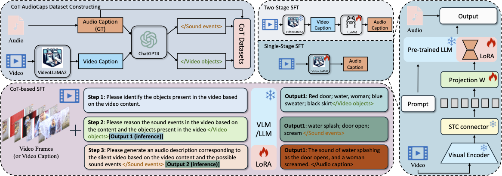

# Hearing from Silence: Reasoning Audio Descriptions from Silent Videos via Vision-Language Model

The CoT-Audiocaps dataset and the inference results of paper: [Hearing from Silence: Reasoning Audio Descriptions from Silent Videos via Vision-Language Model](https://arxiv.org/abs/2505.13062). (Interspeech 2025)

## 1. Introduction


Humans can intuitively infer sounds from silent videos, but whether multimodal large language models can perform modal-mismatch reasoning without accessing target modalities remains relatively unexplored. Current text-assisted-video-to-audio (VT2A) methods excel in video foley tasks but struggle to acquire audio descriptions during inference. We introduce the task of Reasoning Audio Descriptions from Silent Videos (SVAD) to address this challenge and investigate vision-language models' (VLMs) capabilities on this task. To further enhance the VLMs' reasoning capacity for the SVAD task, we construct a CoT-AudioCaps dataset and propose a Chain-of-Thought-based supervised fine-tuning strategy. Experiments on SVAD and subsequent VT2A tasks demonstrate our method's effectiveness in two key aspects: significantly improving VLMs' modal-mismatch reasoning for SVAD and effectively addressing the challenge of acquiring audio descriptions during VT2A inference.
The key findings include:

- We propose the SVAD task designed to address the problem of missing audio descriptions during VT2A inference.
- We explore VLMs' modal-mismatch reasoning capabilities through the SVAD task.
- We propose a CoT-based SFT strategy for the SVAD task and construct the CoT-AudioCaps dataset, significantly enhancing VLMs' modal-mismatch reasoning capabilities.
- Experimental results demonstrate that our method effectively improves performance in the SVAD task and addresses the audio description acquisition challenge in VT2A inference.

<div align="center">
  
</div>

## 2. Dataset

```bash
.
├── CoT-Audiocaps
│   ├── AudioCaps_test.jsonl
│   ├── AudioCaps_train.jsonl
│   └── CoT-AudioCaps_train.jsonl
└── Results
    ├── gpt4o.jsonl
    ├── InternVL2_5-8B.jsonl
    ├── oryx.jsonl
    ├── VideoLLAMA2_LLAMA3_CoT-SFT.jsonl
    ├── VideoLLAMA2_LLAMA3.jsonl
    ├── VideoLLAMA2_LLAMA3SFT-SFT.jsonl
    ├── VideoLLaMA2.1-7B-16F-Chat-CoT-SFT.jsonl
    ├── VideoLLaMA2.1-7B-16F-Chat-SFT.jsonl
    └── VideoLLaMA2.1-7B-16F-Chat.jsonl
```

CoT-Audiocaps contains 42,601 training samples (CoT-AudioCaps_train.jsonl) and 866 test samples (AudioCaps_test.jsonl).

The keys ```gpt4_video_objects``` and ```gpt4_sound_events``` is the label for CoT construction by GPT-4o.

The Results folder contains the inference results of different models for SVAD task, including: gpt4o, InternVL2_5-8B, oryx, VideoLLaMA2.1-7B-16F-Chat (zero-shot, SFT, CoT-SFT), VideoLLaMA2.1-7B-16F-Chat + LLAMA3 (zero-shot, SFT, CoT-SFT).

## 3. Citation
If our dataset and paper help you, please kindly cite:
```
@misc{ren2025hearingsilencereasoningaudio,
      title={Hearing from Silence: Reasoning Audio Descriptions from Silent Videos via Vision-Language Model}, 
      author={Yong Ren and Chenxing Li and Le Xu and Hao Gu and Duzhen Zhang and Yujie Chen and Manjie Xu and Ruibo Fu and Shan Yang and Dong Yu},
      year={2025},
      eprint={2505.13062},
      archivePrefix={arXiv},
      primaryClass={cs.MM},
      url={https://arxiv.org/abs/2505.13062}, 
}
```

<!-- ## Star History

[](https://star-history.com/#BladeDancer957/RevisitingCSS&Date) -->

<!-- ## License Agreement

**License**: The repository is licensed under the [Apache 2.0](LICENSE) License. -->